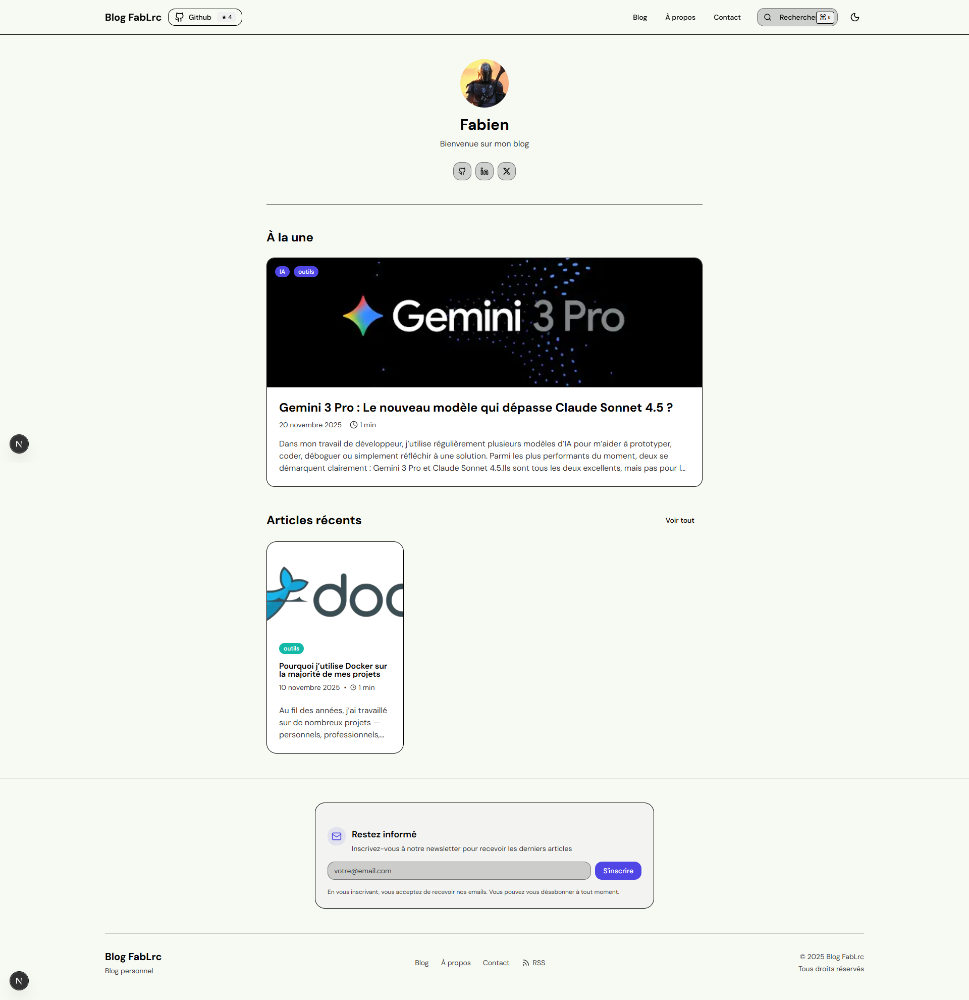
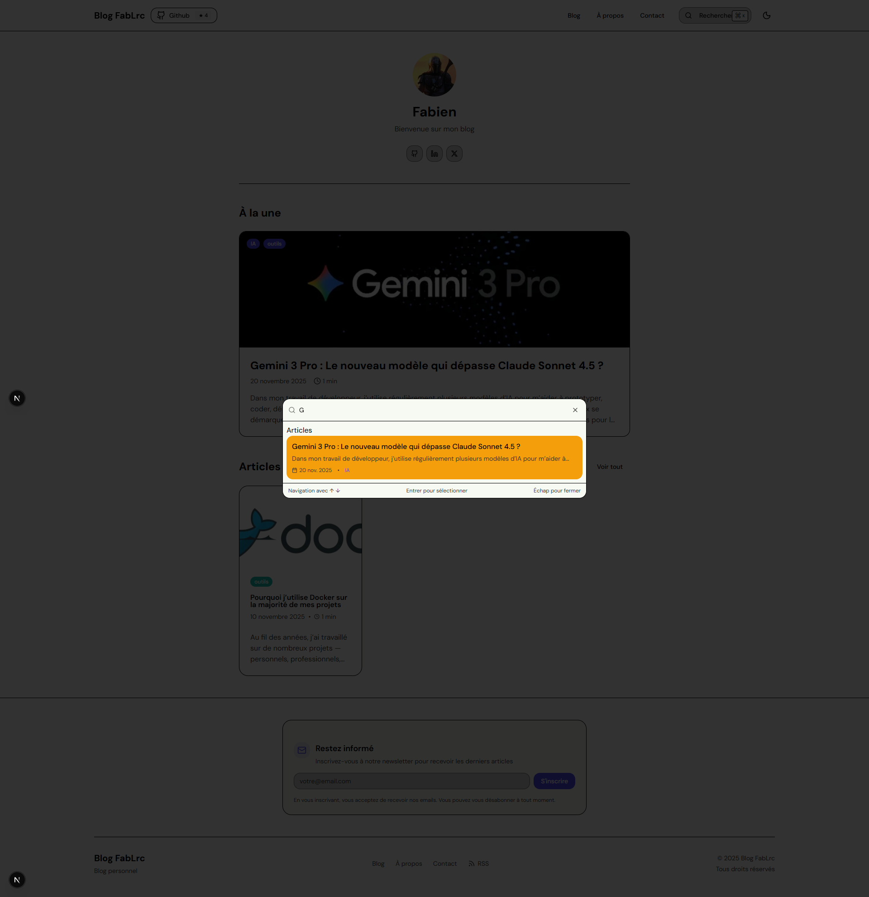
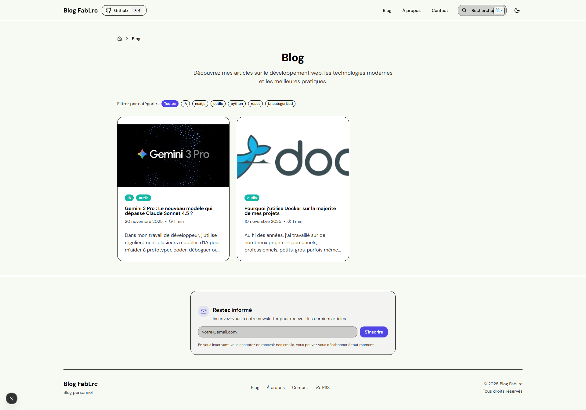
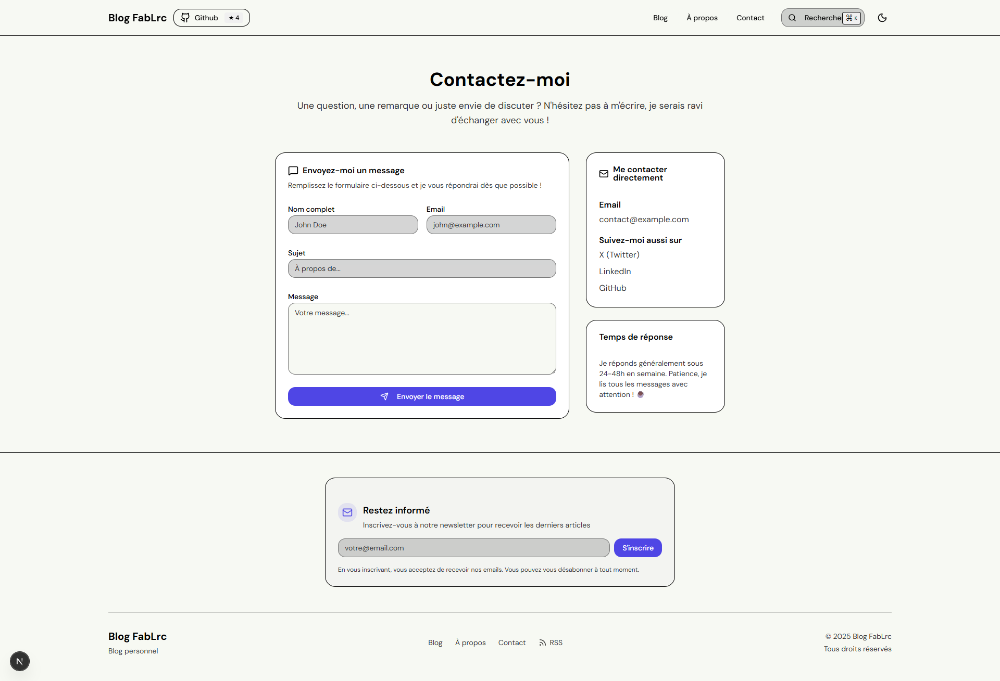

# 📝 Blog Full-Stack

Blog moderne avec Next.js 15 et WordPress (Headless CMS via GraphQL). Design minimaliste avec mode sombre, thème ShadCN UI et **configuration centralisée dans WordPress**.

## 👀 Aperçu

<div align="center">

### Page d'accueil


### Barre de recherche


### Blog


### Article


### Contact


</div>

## 🚀 Stack

- **Frontend**: Next.js 15, TypeScript, Tailwind CSS v4, ShadCN UI
- **Backend**: WordPress (Headless via WPGraphQL)
- **Autres**: html-react-parser, DM Sans, Lucide Icons

## 🏁 Démarrage

```bash
# Frontend uniquement
cd frontend && npm install && npm run dev
```

**Variables d'environnement**: 

Créer `frontend/.env.local`:
```
# WordPress GraphQL API URL
NEXT_PUBLIC_WORDPRESS_API_URL=https://your-wordpress-site.com/graphql

# Site URL (pour SEO, sitemap, RSS, etc.)
NEXT_PUBLIC_SITE_URL=http://localhost:3000
```

> ⚠️ **Note**: Assurez-vous que votre instance WordPress a le plugin **WPGraphQL** installé et activé.
PORT=1337
APP_KEYS="toBeModified1,toBeModified2"
API_TOKEN_SALT=tobemodified
ADMIN_JWT_SECRET=tobemodified
TRANSFER_TOKEN_SALT=tobemodified
JWT_SECRET=tobemodified
ENCRYPTION_KEY=tobemodified
```

## 🐳 Utilisation de Docker

Si vous préférez lancer l'application entière (frontend + backend) dans un seul conteneur via Docker Compose :

1. Construire l'image (depuis la racine du projet) :

```bash
sudo docker-compose build
```

2. Démarrer le conteneur en arrière-plan :

```bash
sudo docker-compose up -d
```

Accès :
- Frontend : http://localhost:3000
- Strapi Admin : http://localhost:1337/admin

Notes :
- Les variables sensibles (secrets Strapi) sont lues depuis `backend/.env` (ou vous pouvez définir des variables d'environnement dans `docker-compose.yml`).
- Cette configuration construit une seule image contenant frontend et backend pour un usage local/dev rapide. Pour un déploiement en production, il est recommandé d'utiliser des conteneurs séparés (un conteneur frontend, un conteneur backend) et de gérer les secrets via un store dédié.

### Déploiement sur NAS et mises à jour automatiques

Voici une méthode simple pour déployer sur un NAS (type gestionnaire de conteneurs, testé avec CasaOS) et mettre à jour automatiquement depuis GitHub :

1. Utiliser GHCR (GitHub Container Registry) pour héberger les images. Le workflow `.github/workflows/build-and-push.yml` (fourni) build et push les images `blog-backend` et `blog-frontend` sur GHCR.
2. Sur le NAS, copier `docker-compose.nas.yml` et remplacer `<OWNER>` par ton nom GitHub/organisation dans les images.
3. Démarrer les services :

```bash
docker-compose -f docker-compose.nas.yml up -d
```

4. Pour mise à jour automatique, Watchtower est inclus dans le compose (`watchtower`) et vérifiera périodiquement si de nouvelles images sont disponibles puis mettra à jour les conteneurs.

Notes :
- Assure-toi que les volumes (`data`, `uploads`) pointent vers des emplacements persistants sur le NAS.
- Crée les secrets GitHub : `GHCR_PAT` (token) et configure-le dans les Secrets du repo pour permettre le push des images depuis GitHub Actions.
- Watchtower a accès au socket Docker via `/var/run/docker.sock`.


## ✨ Fonctionnalités

- ✅ Configuration centralisée dans Strapi (profil, liens sociaux, images, SEO)
- ✅ Multi-catégories par article avec filtres URL-based
- ✅ Recherche instantanée (`Ctrl+K`) en temps réel
- ✅ Table des matières interactive avec scroll spy
- ✅ Mode sombre/clair avec persistance
- ✅ Breadcrumb SEO avec Schema.org JSON-LD
- ✅ Sidebar responsive (TOC + partage social)
- ✅ Rendu Markdown complet (GFM)
- ✅ Navigation précédent/suivant
- ✅ Temps de lecture estimé
- ✅ Flux RSS & Sitemap XML
- ✅ Open Graph & Twitter Cards
- ✅ ISR avec revalidation (1h config, 1min articles)
- ✅ Coloration syntaxique des blocs de code (Shiki/Prism)
- ✅ Barre de progression de lecture
- ✅ Bouton vers le repo Github (avec étoiles)

## 📂 Structure

```
blog/
├── backend/                 # Strapi CMS
│   ├── src/api/            # Content types (articles, categories, authors)
│   ├── config/             # Configuration Strapi
│   └── data/               # Data seed
│
└── frontend/               # Next.js App
    └── src/
        ├── app/            # Routes (App Router)
        │   ├── layout.tsx          # Layout global + metadata
        │   ├── page.tsx            # Homepage (profil)
        │   ├── blog/               # Liste + articles
        │   ├── about/              # À propos
        │   ├── contact/            # Contact
        │   ├── rss.xml/            # Flux RSS
        │   └── sitemap.xml/        # Sitemap
        │
        ├── components/     # Composants React
        │   ├── navbar.tsx          # Navigation principale
        │   ├── footer.tsx          # Footer
        │   ├── breadcrumb.tsx      # Fil d'Ariane + Schema.org
        │   ├── blog-list.tsx       # Liste avec filtres
        │   ├── article-sidebar.tsx # TOC + Partage
        │   ├── contact-form.tsx    # Formulaire contact
        │   └── ui/                 # ShadCN components
        │
        ├── lib/            # Utils
        │   ├── strapi.ts           # API Strapi + getSiteConfig()
        │   └── utils.ts            # Helpers
        │
        └── types/          # TypeScript
            └── strapi.ts           # Interfaces Strapi
```

## 🏗️ Architecture

### Configuration centralisée
- **Toutes les données du site** sont gérées dans Strapi (Single Type `site-config`)
- Le frontend récupère la config via `getSiteConfig()` avec cache 1h
- Fallback automatique si Strapi indisponible

### Pattern Server/Client Components
- **Server Components** : Fetch les données (pages, layout)
- **Client Components** : Interactivité (filtres, recherche, formulaires)
- Config passée via props depuis serveur vers client

### Flux de données
```
Strapi Admin → site-config → API → getSiteConfig() → Server Components → Props → Client Components
```

## ⚙️ Configuration

### 🎛️ Configuration du site (Strapi CMS)
Toute la configuration du site est gérée via Strapi :

1. **Créer le content-type `site-config`** dans Strapi (Single Type)
2. **Configurer les champs** (voir `STRAPI_SITE_CONFIG.md`)
3. **Activer les permissions** : Settings → Users & Permissions → Public → site-config (find ✓)
4. **Remplir les données** : Content Manager → Site Config

**Champs disponibles** :
- Informations du site (nom, description, URL)
- Profil (nom, username, bio, email, avatar)
- Liens sociaux (GitHub, Twitter, LinkedIn, email)
- SEO (meta description, keywords)
- Images (logo, favicon)
- Options (newsletter, commentaires)
- Textes (footer, copyright)

Voir la **documentation complète** : [`STRAPI_SITE_CONFIG.md`](STRAPI_SITE_CONFIG.md)

### 🎨 Thème visuel
- **Couleurs et design** : `frontend/src/app/globals.css`
- **Données démo** : `cd backend && npm run seed:example`

## 🎨 Personnalisation

### Changer le titre du blog
Via **Strapi Admin** → Content Manager → Site Config → `siteName`

Ou temporairement dans le code (`frontend/src/lib/strapi.ts`) :
```typescript
// Valeurs par défaut si Strapi n'est pas disponible
return {
  siteName: "Mon Super Blog",
  // ...
}
```

### URLs importantes
- `/` - Page d'accueil (profil social)
- `/blog` - Liste des articles avec filtres
- `/blog?category=slug` - Articles filtrés par catégorie
- `/blog/[slug]` - Article individuel avec TOC et partage
- `/about` - À propos
- `/contact` - Contact (formulaire + liens sociaux)
- `/rss.xml` - Flux RSS dynamique
- `/sitemap.xml` - Sitemap SEO
- `/robots.txt` - Instructions robots

### API Strapi
- `http://localhost:1337/api/articles` - Articles
- `http://localhost:1337/api/categories` - Catégories
- `http://localhost:1337/api/site-config` - Configuration du site
- `http://localhost:1337/admin` - Panel d'administration

### Raccourcis clavier
- `Ctrl+K` / `Cmd+K` - Ouvrir la recherche
- `↑` / `↓` - Navigation dans les résultats
- `Entrée` - Sélectionner un résultat
- `Échap` - Fermer la recherche

## 🎯 Roadmap

- [ ] View Transitions API
- [ ] Optimisation des images (blur placeholder, WebP/AVIF)
- [ ] Système de thèmes saisonniers 🎃🎄🧧 (auto-switch Halloween, Noël, Nouvel an chinois)
- [ ] Mode Lecture immersif
- [ ] Newsletter fonctionnelle (Resend/SendGrid)
- [ ] Images Open Graph dynamiques (@vercel/og)
- [ ] CI/CD

---

✨ Développé par [FabLrc](https://github.com/FabLrc)

## 📄 Licence

MIT